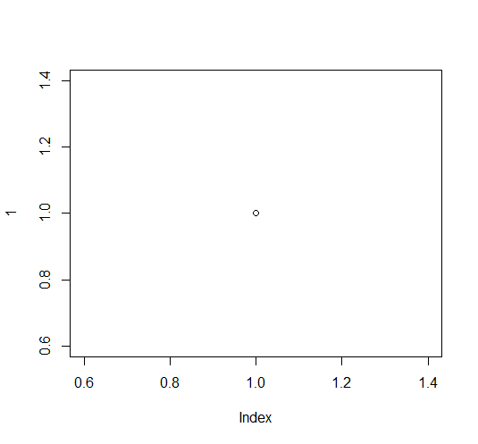

O código abaixo (visível apenas no markdown) é importante para seu script ser reprodutível. Include=F roda o código, mas não exibe nem o código, nem as mensagens do pacote. 
```{r pacotes, include=F}
if(!require('vegan')) install.packages('vegan')
if(!require('knitr')) install.packages('knitr')
```


# Filiação

# Resumo

# Intro
~~Eu~~ adoro *bolo* de **chocolate**

H~2~0

nome^2^

Lista:

- item 1

  - item 1.1

- item 2

- item 3

Lista numerada:

1. item

2. item

3. item



# M&M

## Coleta de dados

## Análise

```{r,echo=F, eval=T, results='asis'}
data('mtcars')
summary(lm(mpg~carb, data=mtcars) )
```


# Resultados

A cerquinha abaixo não mostra o código, nem o resultado dele:
```{r cerquinha do plot, echo=F, eval=F}
plot(1)
```

A cerquinha abaixo mostra o código, mas não o resultado dele
```{r, echo=T, eval= F}
plot(1)
```

A cerquinha abaixo mostra o resultado dele, mas não o código
```{r, echo=F, eval=T}
plot(1)
```

A cerquinha abaixo mostra o resultado e o código
```{r, echo=T, eval=T}
plot(1)
```

A cerquinha abaixo mostra o resultado, o código, e uma figura com legenda
```{r, echo=T, eval=T, fig.cap='Figura 1. Um exemplo de figura'}
plot(1)
```

```{r}
nrow(mtcars); ncol(mtcars)
```

A tabela mtcars tem `r nrow(mtcars)` linhas e `r ncol(mtcars)` colunas.

<br> Tabela 1. Modelos de carros antigos e suas características.
```{r, echo = F}
data('mtcars')
kable(mtcars)
```


# Discussão
Estou citando Fulano [@Dee2019].

Segundo @Dee2019, isso pode acontecer.

Estou citando várias pessoas que fizeram isso [@Dee2019; @Oliveira-Filho1995a]

# Referência